## Experimento

Nesse experimento, temos interesse em discutir e analisar os dados de temperatura e consumo de energia na sala de servidor do Laboratório de Tecnologias de Comunicação (LATEC). Contexto geral pode ser acessado [aqui](https://docs.google.com/document/d/1FHt9EiUNod5aRUt1ybuSwAqq5184zNyDMWIHz3JWLO8/edit?usp=sharing).

## Sobre os dados

### Dados de consumo do ar-condicionado do LATEC

Esses dados foram obtidos a partir de sensores fabricados pela empresa *Sonoff*, especializada em equipamentos de automação industrial e residencial. Especificamente para esses dados de consumo, foram utilizados equipamentos do tipo *Sonoff Pow R2*, um atuador e medidor de Potência Ativa, Tensão RMS e Corrente RMS, que são medidos na unidade Watts (W). Os dados de consumo coletados vão de junho de 2021 a dezembro de 2021.


```
## Rows: 4,868
## Columns: 20
## $ Nome               <chr> "PowLatec", "PowLatec", "PowLatec", "PowLatec", "Po…
## $ Data               <chr> "01/06/2021, 7:00:00", "01/06/2021, 8:00:00", "01/0…
## $ potencia_total     <dbl> 1275.329, 1323.580, 1319.816, 1359.160, 1458.576, 1…
## $ `P - Fase A (W)`   <dbl> 0, 0, 0, 0, 0, 0, 0, 0, 0, 0, 0, 0, 0, 0, 0, 0, 0, …
## $ `P - Fase B (W)`   <dbl> 0, 0, 0, 0, 0, 0, 0, 0, 0, 0, 0, 0, 0, 0, 0, 0, 0, …
## $ `P - Fase C (W)`   <dbl> 1275.329, 1323.580, 1319.816, 1359.160, 1458.576, 1…
## $ `Q - Total (var)`  <dbl> 0, 0, 0, 0, 0, 0, 0, 0, 0, 0, 0, 0, 0, 0, 0, 0, 0, …
## $ `Q - Fase A (var)` <dbl> 0, 0, 0, 0, 0, 0, 0, 0, 0, 0, 0, 0, 0, 0, 0, 0, 0, …
## $ `Q - Fase B (var)` <dbl> 0, 0, 0, 0, 0, 0, 0, 0, 0, 0, 0, 0, 0, 0, 0, 0, 0, …
## $ `Q - Fase C (var)` <dbl> 0, 0, 0, 0, 0, 0, 0, 0, 0, 0, 0, 0, 0, 0, 0, 0, 0, …
## $ `FP - Total`       <dbl> 1, 1, 1, 1, 1, 1, 1, 1, 1, 1, 1, 1, 1, 1, 1, 1, 1, …
## $ `FP - Fase A`      <dbl> 1, 1, 1, 1, 1, 1, 1, 1, 1, 1, 1, 1, 1, 1, 1, 1, 1, …
## $ `FP - Fase B`      <dbl> 1, 1, 1, 1, 1, 1, 1, 1, 1, 1, 1, 1, 1, 1, 1, 1, 1, …
## $ `FP - Fase C`      <dbl> 1, 1, 1, 1, 1, 1, 1, 1, 1, 1, 1, 1, 1, 1, 1, 1, 1, …
## $ `V - Fase A (V)`   <dbl> 0, 0, 0, 0, 0, 0, 0, 0, 0, 0, 0, 0, 0, 0, 0, 0, 0, …
## $ `V - Fase B (V)`   <dbl> 0, 0, 0, 0, 0, 0, 0, 0, 0, 0, 0, 0, 0, 0, 0, 0, 0, …
## $ `V - Fase C (V)`   <dbl> 219.5782, 221.0760, 221.2121, 220.6594, 220.9196, 2…
## $ `I - Fase A (A)`   <dbl> 0, 0, 0, 0, 0, 0, 0, 0, 0, 0, 0, 0, 0, 0, 0, 0, 0, …
## $ `I - Fase B (A)`   <dbl> 0, 0, 0, 0, 0, 0, 0, 0, 0, 0, 0, 0, 0, 0, 0, 0, 0, …
## $ `I - Fase C (A)`   <dbl> 6.090717, 6.374917, 6.335446, 6.459529, 6.962180, 7…
```

**Colunas importantes**

```
Data ->  data e hora da medição
potencia_total -> valor em watts (W) que o sensor indicou no momento da medição
```

### Dados de temperatura da sala do LATEC

Esses dados também foram obtidos a partir de sensores fabricados pela empresa *Sonoff*. Especificamente para esses dados de temperatura da sala, foram utilizados equipamentos do tipo *Sonoff TH16*, um atuador e medidor de temperatura (ºC) e umidade (%). Para essa análise, vamos considerar um conjunto de dados obtido em **dezembro** com dados do período de agosto de 2021 a dezembro de 2021, a partir de um script que se comunica com os sensores citados.


```
## Rows: 242,190
## Columns: 3
## $ timestamp   <dbl> 1626199168, 1626199730, 1626200278, 1626200340, 1626200401…
## $ temperature <dbl> 16.8, 16.8, 16.8, 16.8, 16.8, 16.8, 16.8, 16.8, 16.8, 16.8…
## $ humidity    <dbl> 65, 59, 59, 59, 59, 59, 59, 59, 59, 59, 59, 59, 59, 59, 59…
```

**Colunas importantes**

```
timestamp ->  representação em unix timestamp do momento da a medição
temperature -> valor em ºC que o sensor indicou no momento da medição
```

**Importante**: O valor de temperatura obtido pelo sensor corresponde à temperatura ambiente na qual a sala se encontra no momento da medição, e não o que o indicador de temperatura do ar-condicionado está sinalizando.

### Dados climáticos de Campina Grande

Os dados climáticos da cidade de Campina Grande, como precipitação, radiação, temperatura (ºC), foram obtidos a partir de dados acessíveis publicamento do [Instituto Nacional de Meteorologia (INMET)](https://portal.inmet.gov.br/dadoshistoricos), e coletados no período de junho de 2021 a novembro de 2021.


```
## Rows: 8,760
## Columns: 20
## $ data                                       <date> 2021-01-01, 2021-01-01, 20…
## $ hora_utc                                   <chr> "0000 UTC", "0100 UTC", "02…
## $ precipitacao_total                         <dbl> 0.4, 0.2, 0.0, 0.0, 0.2, 0.…
## $ pressao_atmosferica_estacao_mB             <dbl> 953.1, 952.9, 952.6, 952.2,…
## $ pressao_atmosferica_max_hora_ant_mB        <dbl> 953.1, 953.1, 952.9, 952.7,…
## $ pressao_atmosferica_min_hora_ant_mB        <dbl> 952.5, 952.9, 952.6, 952.1,…
## $ radiacao_global                            <dbl> NA, NA, NA, NA, NA, NA, NA,…
## $ temperatura_do_ar                          <dbl> 22.1, 21.7, 21.9, 21.9, 21.…
## $ temperatura_ponto_orvalho                  <dbl> 21.0, 21.0, 21.1, 21.0, 20.…
## $ temperatura_max_hora_ant                   <dbl> 23.4, 22.2, 22.0, 22.0, 21.…
## $ temperatura_min_hora_ant                   <dbl> 22.1, 21.6, 21.7, 21.8, 21.…
## $ temperatura_orvalho_max_hora_ant           <dbl> 21.3, 21.2, 21.2, 21.1, 21.…
## $ temperatura_orvalho_min_hora_ant           <dbl> 20.8, 20.9, 21.0, 20.9, 20.…
## $ `UMIDADE REL. MAX. NA HORA ANT. (AUT) (%)` <dbl> 94, 96, 96, 95, 97, 97, 98,…
## $ `UMIDADE REL. MIN. NA HORA ANT. (AUT) (%)` <dbl> 86, 93, 95, 94, 95, 97, 97,…
## $ `UMIDADE RELATIVA DO AR, HORARIA (%)`      <dbl> 93, 96, 95, 95, 97, 97, 98,…
## $ `VENTO, DIREÇÃO HORARIA (gr) (° (gr))`     <dbl> 173, 179, 197, 194, 183, 17…
## $ `VENTO, RAJADA MAXIMA (m/s)`               <dbl> 9.0, 9.0, 6.8, 8.3, 8.5, 6.…
## $ `VENTO, VELOCIDADE HORARIA (m/s)`          <dbl> 3.9, 3.7, 4.2, 4.8, 2.2, 2.…
## $ ...20                                      <lgl> NA, NA, NA, NA, NA, NA, NA,…
```

**Colunas importantes**

```
data ->  dia em que foi feita a medição
hora_utc -> horário do dia em que foi feita a medição
temperatura_max_hora_ant -> valor máximo em ºC que o sensor indicou no momento anterior ao da medição
temperatura_min_hora_ant -> valor mínimo em ºC que o sensor indicou no momento anterior ao da medição
```

**OBS**: para cada horário registrado, tem dados de temperatura máxima e mínima, portanto, para determinar a temperatura externa no decorrer desta análise, vamos fazer uma média entre o ambos os valores.

## O Estudo

No contexto do Smart Campus/UFCG, têm sido realizadas ações de gerência inteligente de energia com ênfase em análise e visualização de dados de consumo em algumas salas e ambientes do Campus I/Campina Grande, por meio de um dashboard. Uma oportunidade de expandir tais ações é no contexto de atuação sobre o uso do ar condicionado que é um dos principais responsáveis pelo consumo total de energia no campus, especialmente em salas de servidores dedicados como o LATEC, que precisam de refrigeração constante.

Portanto, nessa análise inicial, vamos identificar a relação entre a temperatura (interna e externa) e o consumo de energia. O cálculo do consumo é feito da seguinte forma:

$consumo = \frac{potencia * horas}{1000}$

```
Unidades de medida:

Consumo -> KWh (quilowatts hora)
Potência -> W (watts)
Horas -> h (horas)
```

## Análise de consumo do ar-condicionado

Abaixo, podemos visualizar a distribuição do consumo de energia do ar-condicionado do LATEC nos meses de Junho a Novembro.

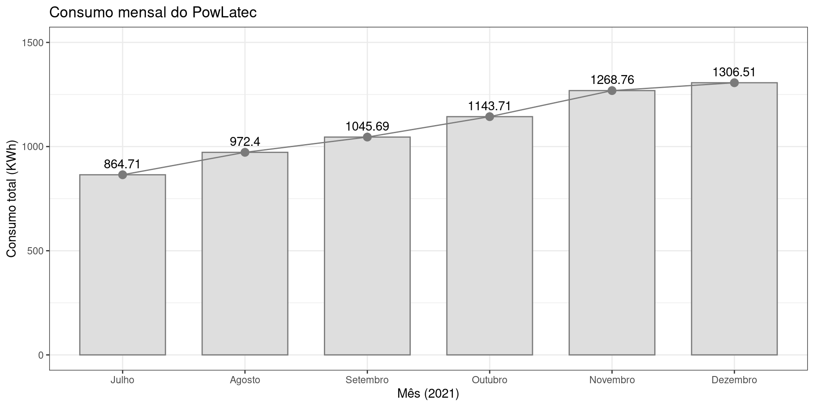

Ao passar dos meses, houve um aumento progressivo de consumo. Se é necessário um resfriamento constante da sala para que não haja superaquecimento dos servidores presentes na sala, ela está sempre fechada e não há trânsito de pessoas, o esperado seria que o consumo se mantivesse constante durante todo o período. Porém, há um aumento considerável e progressivo entre os meses de julho e novembro. Ao decorrer dessa análise, vamos investigar fatores que podem ter ocasionado esse aumento.

Agora, vamos fazer um tratamento nos dados para mostrar o consumo médio por horário do dia, durante o período em que foram coletados os dados.

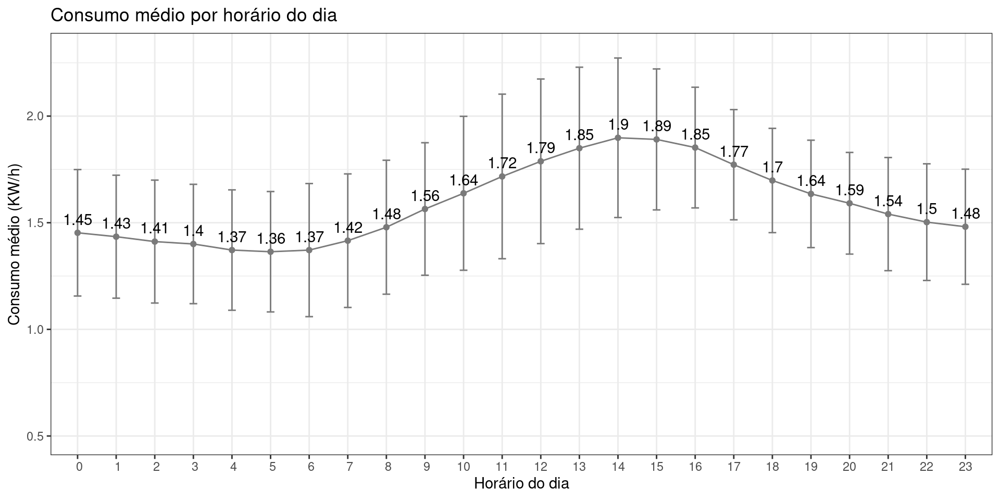

A partir do gráfico acima, podemos identificar que existe um aumento na média do consumo entre 7h e 16h, em relação a cada horário do dia. Partindo dessa premissa, é possível que exista uma relação com a temperatura externa à sala, já que possivelmente esse intervalo de horários corresponde ao período do dia em que estava mais quente.

Vamos olhar, agora, um gráfico que mostra a média de consumo por dia da semana do ar-condicionado do LATEC.

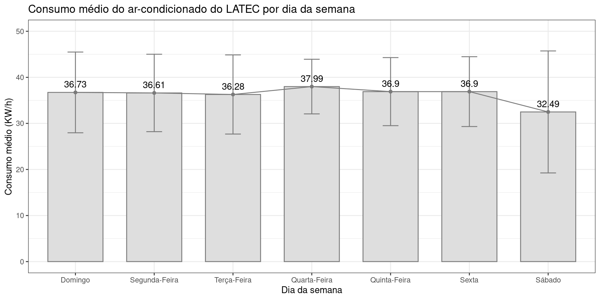


A partir do gráfico acima, podemos ver que não há uma variação muito grande na média do consumo do ar-condicionado do LATEC de domingo a sexta, sempre se mantendo praticamente igual para todos esses dias, porém há uma queda nessa média no sábado, além de ter uma maior variação observada pelo desvio padrão.

Levando em consideração que a média de temperatura se mantém a mesma em quase todos os dias, é provável que aquele comportamento de variação ao longo do dia nos horários que possivelmente está mais quente possa ser parecido nos dias analisados.

Analisado o panorama geral dos seis meses agregados, e dada a existência desse aumento gradual do consumo, vamos visualizar detalhadamente o consumo em cada mês.


Como é possível perceber a partir da visualização acima, tivemos alguns dias em que não houve medição no consumo. Isso pode ter sido causado devido a fatores como falha na captação dos dados por parte dos sensores, por exemplo. O mês de julho foi o que teve maior incidência de valores muito baixos de medição de consumo. Possíveis fatores que podem ter ocasionado essas variações muito grandes são queda de energia, desligamento do ar-condicionado em alguns dias (o que teoricamente não deveria acontecer, pois a sala deve ser mantida integralmente resfriada).

Agora ao invés de observar o total, vamos observar a média de consumo diário agrupado por mês.

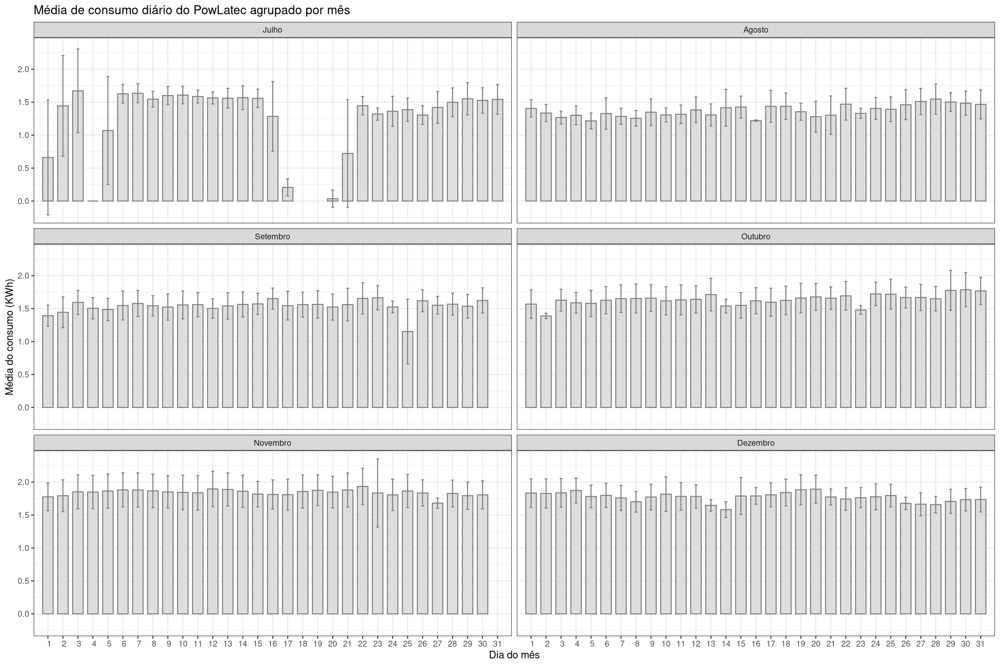

Também é possível observar uma maior incidência de valores baixos de média e grandes variações de desvio padrão no mês de julho. Nos meses seguintes, as variações são mais eventuais, e a distribuição mais uniforme.

Agora, vamos observar a análise de consumo por horário do dia agrupada por mês.

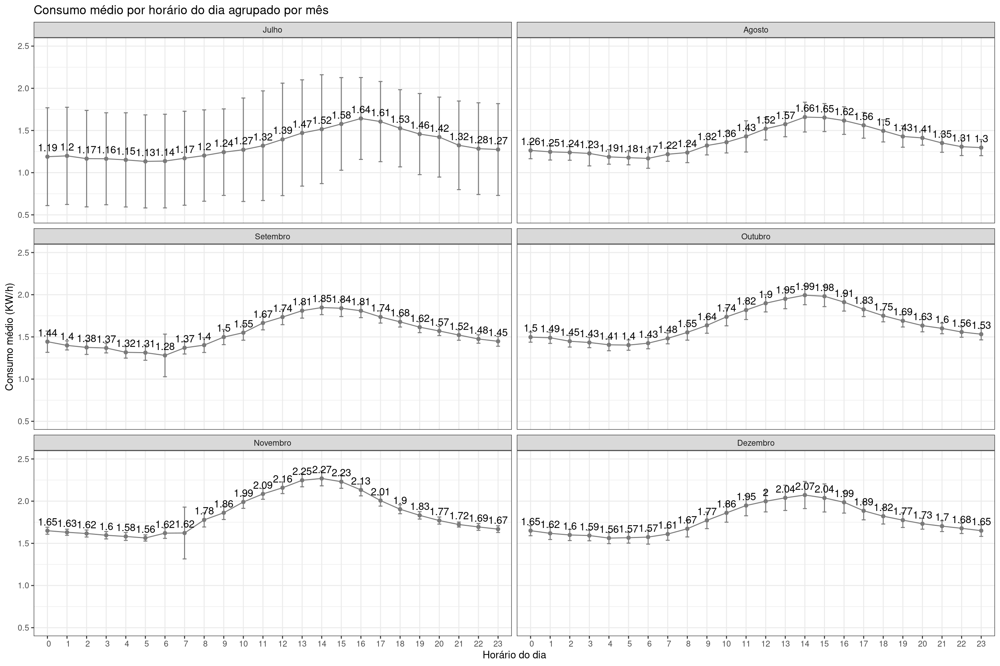

Como esperado, os dados do mês de julho tiveram mais uma vez a maior variação de desvio padrão, observada no intervalo de confiança de seu gráfico. Nos demais meses, variações muito grandes no dp ocorrem esporadicamente.

Por fim, vamos visualizar a distribuição de média de consumo por dia da semana, também agrupada por mês.

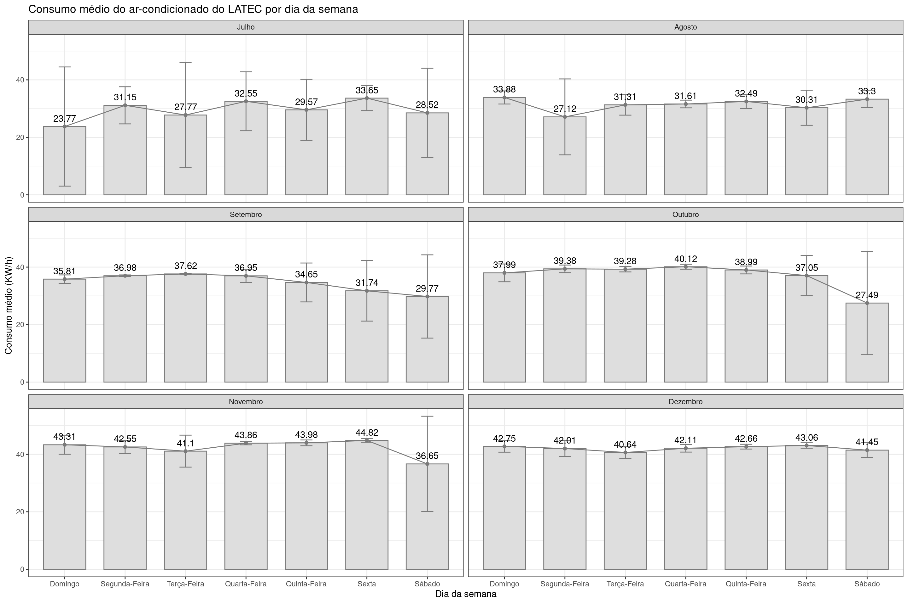

## Análise de temperatura interna

Agora, vamos fazer uma análise de como se comporta a temperatura interna da sala do LATEC a partir das medições dos sensores.

Vamos visualizar algumas distribuições de temperatura da **sala do LATEC**, obtidas a partir do resfriamento da sala a partir do ar condicionado.

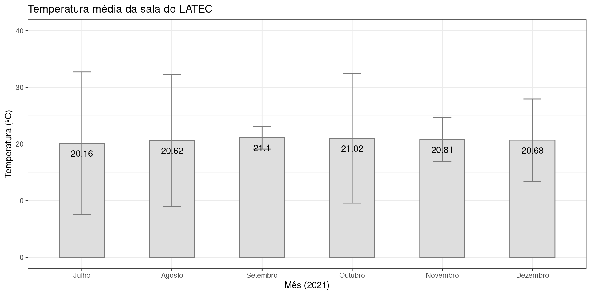

A temperatura média interna da sala, de acordo com os dados obtidos em dezembro, se manteve estável durante os meses, porém é possível perceber a existência de alguns outliers nos meses em que o desvio padrão é mais elevado que os demais: Julho, Agosto, Outubro e Dezembro.

Agora, vamos analisar um gráfico que mostra a média de temperatura da sala do LATEC por horário do dia.

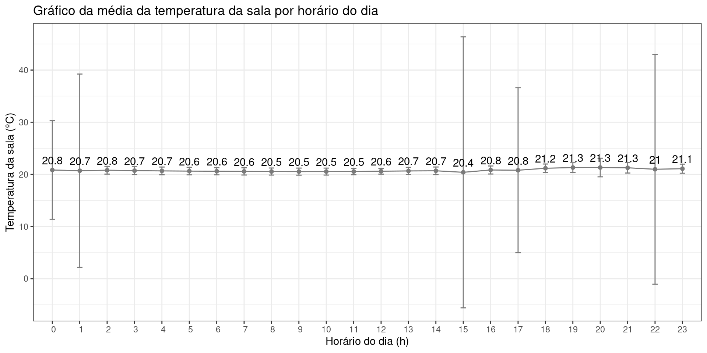

A partir das duas visualizações acima, da temperatura média da sala em três meses e da temperatura média da sala por horário do dia, de acordo com os dados obtidos em dezembro, podemos observar que a temperatura ambiente da sala mantém a média estável ao longo do dia, porém há momentos em que vá variações identificadas no intervalo de confiança de alguns horários do dia.

A fim de tentar identificar quando acontecem essas grandes variações, vamos fazer análises agrupadas por meses da temperatura interna da sala.

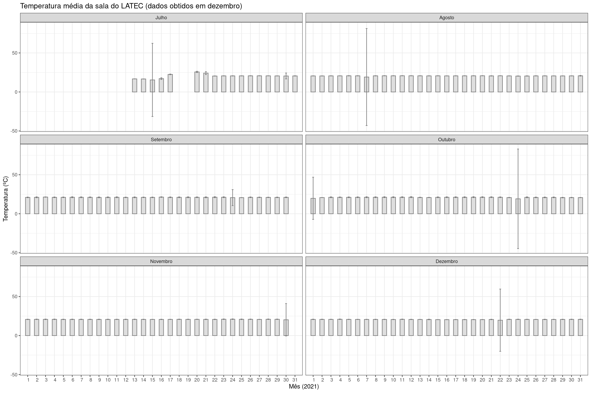

Como é possível analisar nos gráficos acima, notamos que a partir de agosto, a média da sala se mantém equilibrada, mas alguns dias têm desvios padrão bem mais elevados que outros, além de que Julho foi o que apresentou maior variação na média da temperatura interna dentre os meses analisados, enquanto que nos demais a média de temperatura se manteve estável.

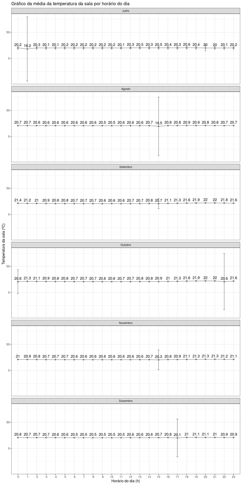

## Análise de temperatura externa (temperatura da cidade de Campina Grande)

Agora, vamos fazer uma análise sobre a temperatura de Campina Grande, a fim de identificar uma possível relação com consumo. Primeiramente, vamos visualizar a média de temperatura por mês de Campina Grande durante o período em que os dados obtidos pelo INMET foram coletados:

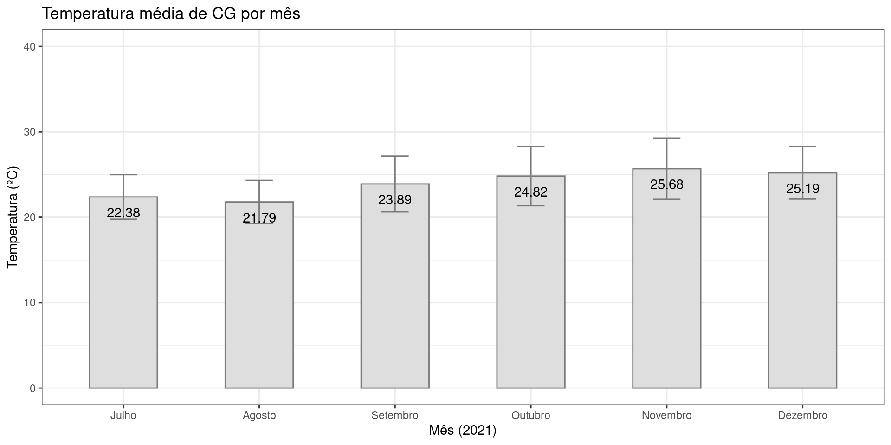

Como esperado, os meses com menores médias de temperatura foram entre Junho e Agosto, com uma subida considerável da média nos meses seguintes de Setembro a Novembro.

Agora, vamos ver a distribuição média da temperatura registrada na cidade de Campina Grande no período observado, agrupada por horário do dia.

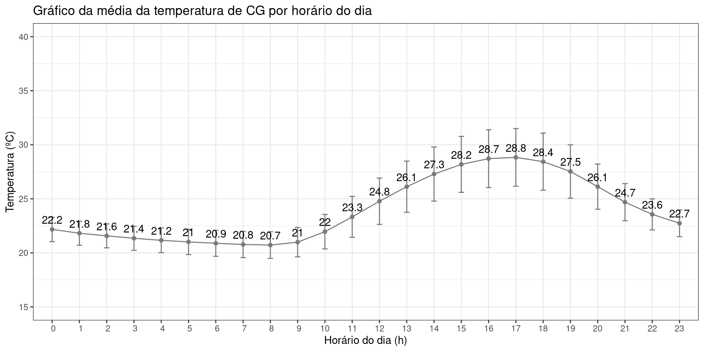

A partir da observação do gráfico acima, podemos notar que existe uma semelhança entre as formas do gráfico de consumo médio por horário do dia e de temperatura de Campina Grande por horário do dia, o que pode significar alguma correlação entre os dois fatores: consumo e temperatura externa à sala.

Por fim, vamos visualizar dados de temperatura externa agrupados por mês.

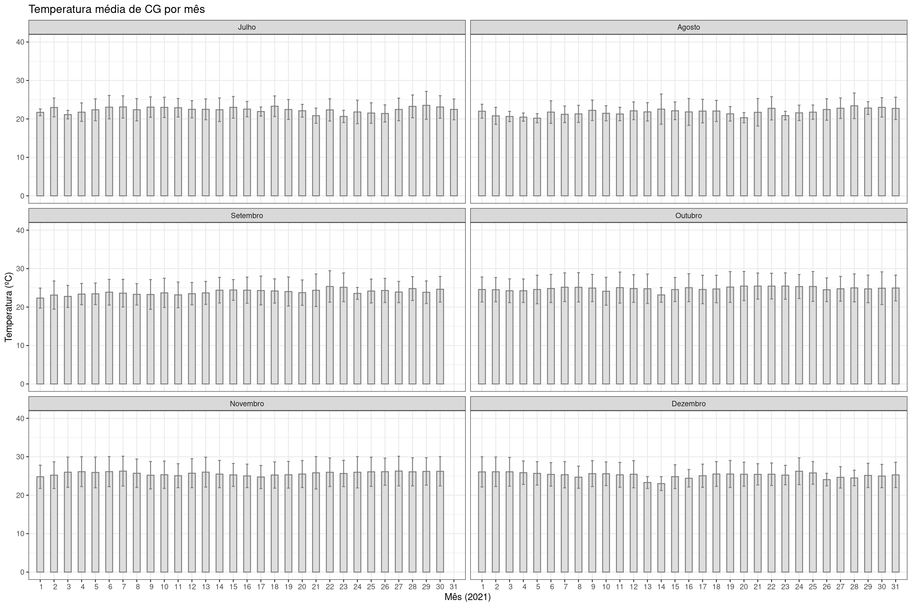

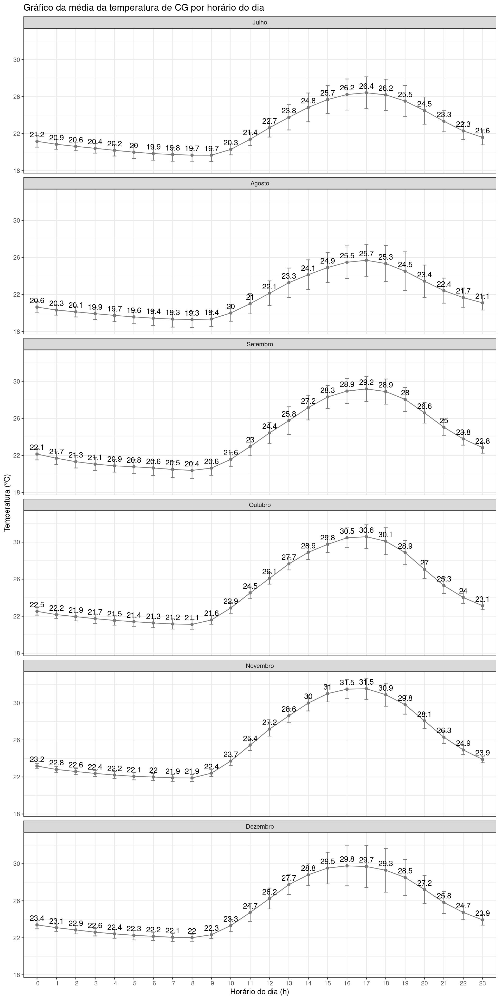

## Correlação entre temperatura externa e consumo

Agora, vamos fazer uma dispersão com os dados brutos de consumo e temperatura externa da cidade de Campina Grande para tentar identificar essa correlação.


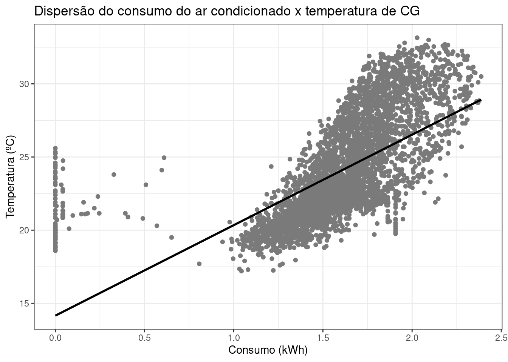


```
## # A tibble: 1 × 1
##   corr_pearson
##          <dbl>
## 1        0.637
```

Neste primeiro gráfico de dispersão, obtivemos um resultado diferente do que esperávamos. Uma dispersão um pouco maior do que imaginamos, com coeficiente de correlação de aproximadamente **0.64**, que indica que **existe uma correlação, mas moderada**. Porém, muitos dados estão concentrados em regiões específicas (que pode significar um problema na obtenção dos dados). Alguns pontos que indicam consumo zero podem ser de dados do mês de julho, que apresentou dispersões maiores que o restante dos meses. Para tentar identificar esses casos suspeitos, vamos fazer uma dispersão de meses separadamente:

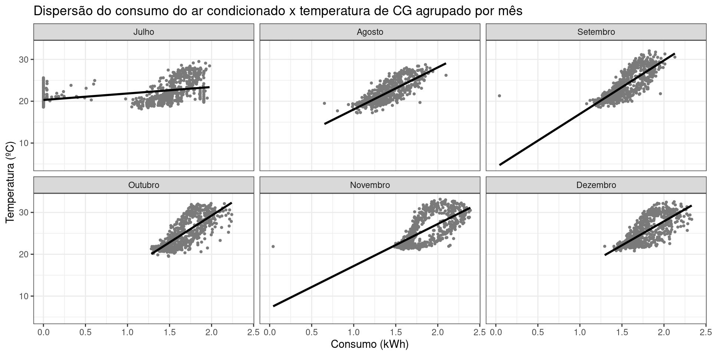

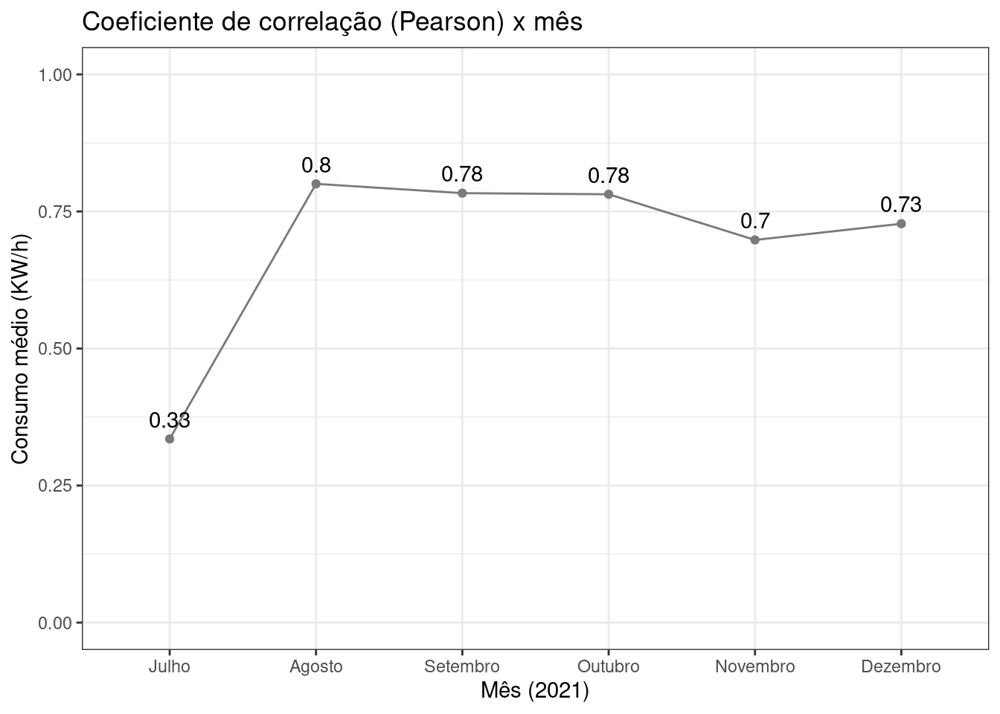

Podemos observar que, em julho, temos um coeficiente de **0.33** aproximadamente, o que também indica uma **correlação desprezível** nesse mês, possivelmente causada pela grande variação observada nas análises anteriores. Porém, nos meses seguintes em que as variações não são tão grandes, o coeficiente de Pearson é de **0.8**, **0.78**, **0.78**, **0.7** e **0.73** respectivamente, que indicam uma **correlação forte**.

## Correlação entre temperatura interna e consumo

Para entender como a variação da temperatura interna da sala influencia no consumo, vamos realizar uma dispersão dos dados de consumo e de temperatura interna também, na tentativa de encontrar alguma correlação entre esses dois fatores.

**Importante**: para essa análise, vamos utilizar os dados de temperatura interna obtidos em dezembro, pois são os mais atualizados.


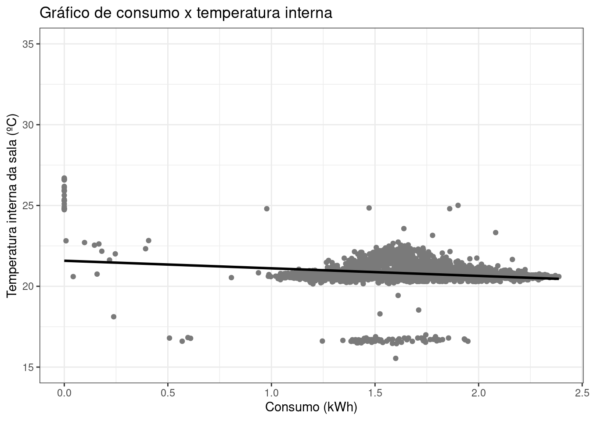


```
## # A tibble: 1 × 1
##   corr_pearson
##          <dbl>
## 1       -0.107
```

A partir da análise do gráfico e do coeficiente de Pearson aproximadamente igual a **-0.1**, pode-se dizer que existe uma **correlação desprezível** entre os dois fatores, ou seja, não há indícios de que o aumento da temperatura interna da sala diminui o consumo. Porém, também estão contabilizados os dados com grande variação do mês de julho, então vamos agrupar por meses novamente.

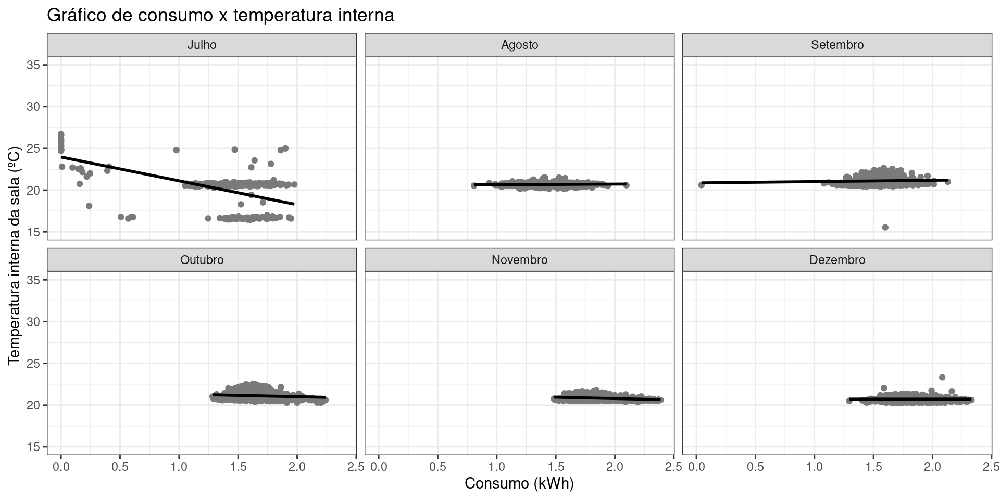

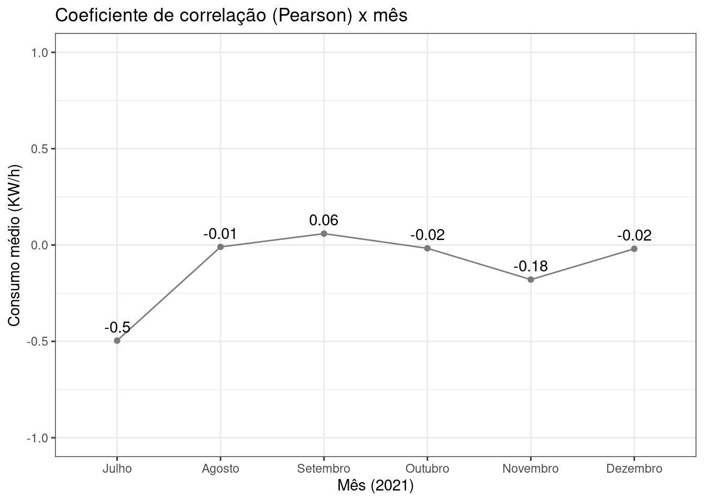

Ao analisar o gráfico do mês de julho, em que é sabido que houve maior variação de consumo, podemos identificar que o coeficiente de Pearson é de aproximadamente **-0.5**, o que indica uma **correlação negativa de moderada para fraca**. Porém, de agosto a dezembro, meses em que não há muita variação do consumo e a temperatura se mantém mais constante, a **correlação é desprezível**, com valores de coeficiente respectivamente **-0.01**, **0.06**, **-0.02**, **-0.18** e **-0.02**.

## Correlação entre temperatura interna e externa

Por fim, vamos analisar a dispersão da temperatura da sala do LATEC com a temperatura externa, para identificar algum tipo de correlação entre ambas as temperaturas.


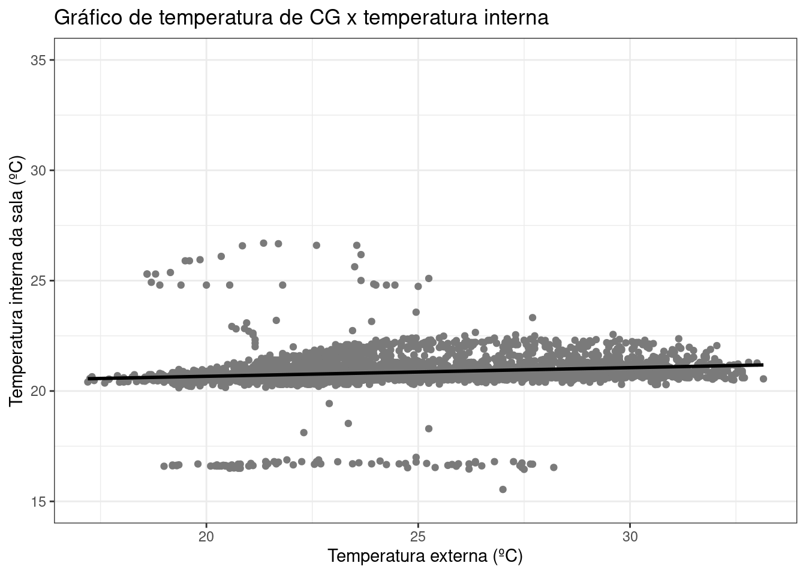


```
## # A tibble: 1 × 1
##   corr_pearson
##          <dbl>
## 1       0.0898
```

Portanto, a partir do gráfico de dispersão podemos ver que existe uma **correlação negativa moderada** entre a temperatura interna da sala e a temperatura externa, já que essa está não sendo mantida o tempo inteiro dentro de um padrão pelo refrigerador de ar, como deveria. O coeficiente de Pearson tem valor de aproximadamente **-0.55**.

